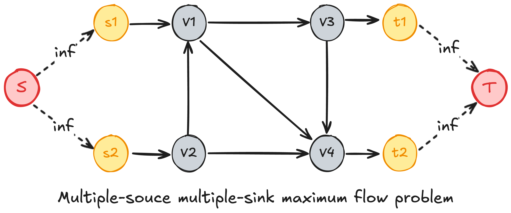

<!-- 
_class: slide_title
_paginate: skip
-->

<div>

<h1>This is  the slide title</h1>

<p>Panpan Zheng</p>
</div>


---

# Outline


---

<!-- _class: section_title -->



# This is Section title

---
# Test Table

The following is a test table


|col1|col2|
|----|----|
|1   | 2  |
|1   | 2  |
|1   | 2  |
|1   | 2  |

---
# maximum flow problem

This is an important problem in flow graphs, each edge has capacity


---


---

# Reversed edges


---

## <!--fit-->Huge


---

# multi-columns

<div class="columns">
  <div>

  - this
  - is the 
  - first column

  </div>

  <div>


    def add(a,b):
      return a + b


  </div>
</div>

---
<!--
_class: columns
_footer: Guo, Guang, and Kathleen Mullan Harris. "The mechanisms mediating the effects of poverty on children’s intellectual development." Demography 37.4 (2000): 431-447.
-->


# Code block

Times New Roman is a serif typeface commissioned for use by the British newspaper The Times in 1931. It has become one of the most popular typefaces of all time and is installed on most personal computers. The typeface was conceived by Stanley Morison, the artistic adviser to the British branch of the printing equipment company Monotype, in collaboration with Victor Lardent, a lettering artist in The Times's advertising department.


<pre class="code1"><code id="code1.1"></code></pre>

<!--  -->

---

<pre>
<code class="language-julia">using Flux
println("htllo")
</code></pre>


```julia
println("htllo")
```


<pre class="code1"><code id="code1.2"></code></pre>

<script>
  document.getElementById("code1.1").textContent =
`def greet(name):
    print(f"Hello, {name}!")

greet("Julia")`;
  document.getElementById("code1.2").textContent =
`def greet(name):
    print(f"Hello, {name}!")

greet("Julia")`;
</script>


---
<script src="https://cdnjs.cloudflare.com/ajax/libs/highlight.js/11.7.0/highlight.min.js"></script>
<script src="https://cdnjs.cloudflare.com/ajax/libs/highlight.js/11.9.0/languages/julia.min.js"></script>
<script>hljs.highlightAll();</script>
